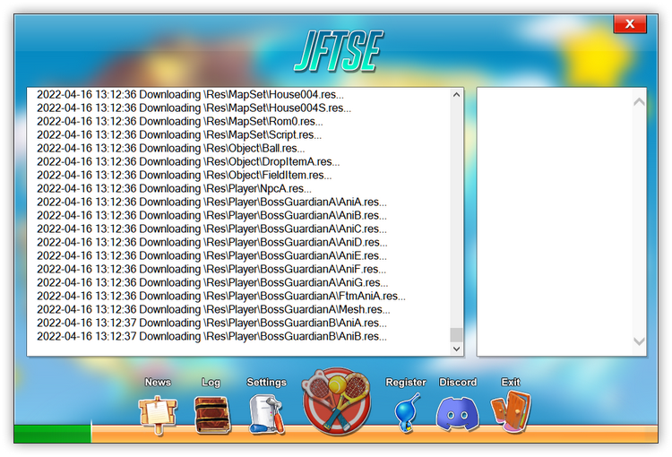

# FT Launcher

## Introduction

The **FT Launcher** is an open source project to replace the original launcher/patcher of the game **Fantasy Tennis**.

It is heavily inspired by the discontinued **Phoenix Fastload Advanced** launcher, that I released in 2009 when the game was still active.

As a result of the [JFTSE - Java Fantasy Tennis Server Emulator](https://github.com/sstokic-tgm/JFTSE) progress, I completely rebuild the launchers core functions using C# and Windows Forms while also keeping its original style.

## Installation

Grab the binary from the [RELEASE](/releases/latest) section or build your own version using [Microsoft Visual Studio](https://visualstudio.microsoft.com/).

## Usage

### Configuration

Despite its name, the FT Launcher can keep any application up-to-date as it is freely configurable. Along with the FT_Launcher.exe, there is a file named **FT_Launcher.exe.config**, that can be used to modify certain parameters within the `<appSettings>` tag.

| key            | example                    | description                                                                                                                       |
|----------------|----------------------------|-----------------------------------------------------------------------------------------------------------------------------------|
| updateUrl      | http://localhost/update/   | Path to the remote url that contains all patch files and the **files.md5**. Don't forget to include the trailing slash of the URL |
| newsUrl        | http://localhost/news.html | Website to be shown in the news tab                                                                                               |
| launchFile     | FT_Client.exe              | Application that is launched after successfully checking for updates                                                              |
| launchFileArgs | 0                          | Command line arguments for the launched application                                                                               |

### Providing update files

The launcher checks the `<updateUrl>/files.md5` to determine which local files (relative to the launcher path) are missing or needed to be updated. Therefore, you need to upload all game/application files to a remote webserver along with the checksum file.

You can generate the files.md5 by launching the FT_Launcher.exe **while holding the *Shift*-Key**. You will see an additional button "Create Checksum" that lets you select a directory and build the files.md5 for you.

The launcher can also update itself, if it is part of the checksum list.